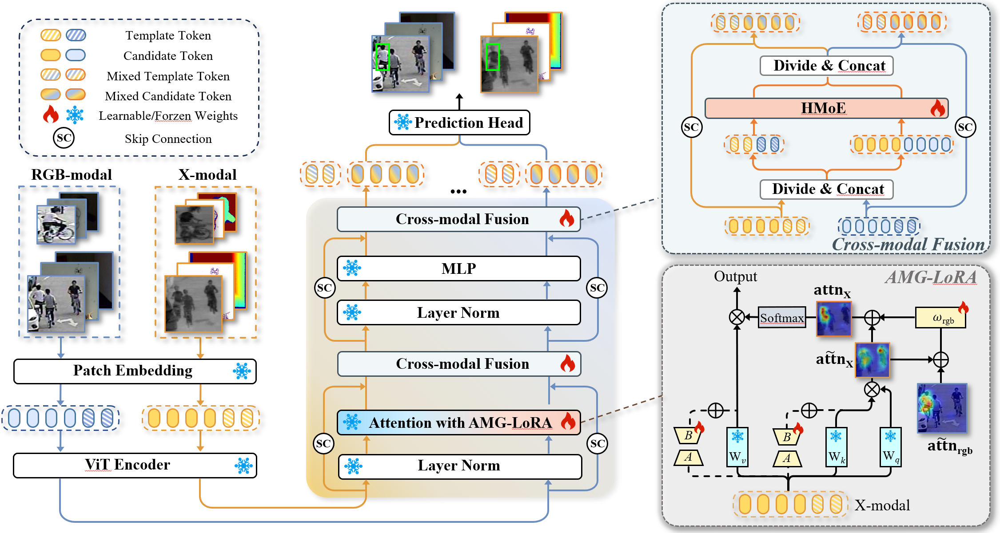
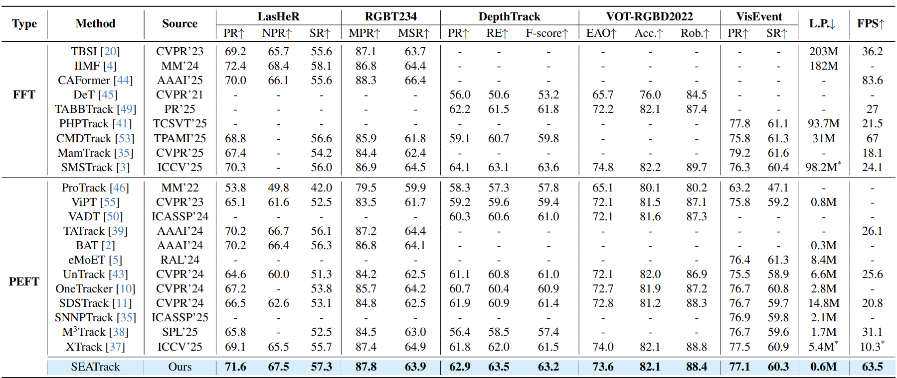
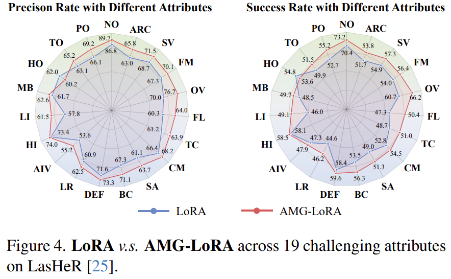
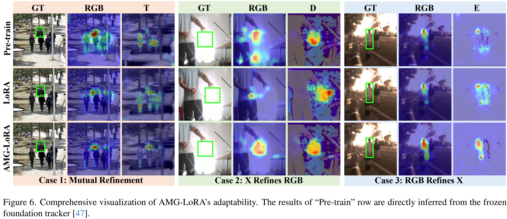
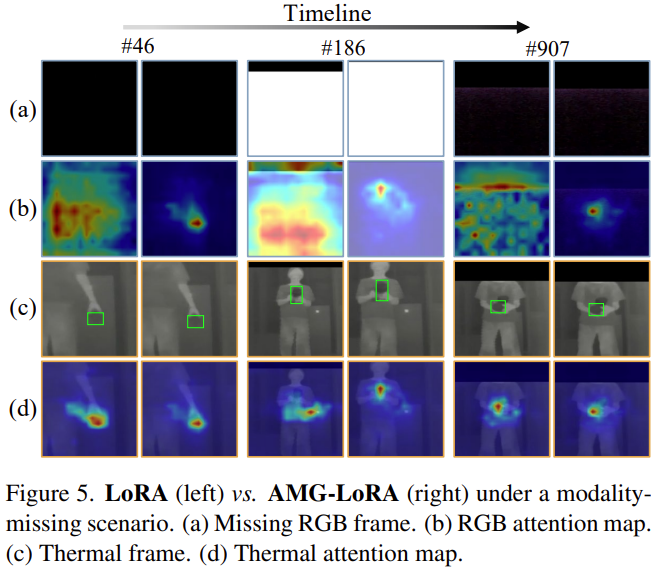

# 🌊 [CVPR 2026 Oral] SEATrack: Simple, Efficient, and Adaptive Multimodal Tracker

<p align="center">
  📄 <a href="">Paper</a> &nbsp;|&nbsp;
  📦 <b>Models & Results:</b>
  <a href="https://drive.google.com/drive/folders/1dDKtK11pX8rmP1pYvgpdLndNjX2hqjYQ?usp=sharing">Google Drive</a>
  &nbsp;/&nbsp;
  <a href="https://pan.baidu.com/s/1QNFkLc0AXvQ8l7LkUYYcCg?pwd=r4s7">Baidu Drive</a>
</p>

---

## 🔥 News
- **[Apr 13, 2026]** Code, models, and raw results are released.

---

## 🧠 Introduction

- 🌊 A **simple unified multimodal tracking framework** for RGB-T, RGB-D, and RGB-E tasks.  
- 🚀 Achieves strong performance across multiple multimodal benchmarks.  
- ⚡ Highly efficient: only **0.6M trainable parameters** and **63.5 FPS**.  
- 🔍 Highlights the importance of **cross-modal alignment** in multimodal tracking.

<div align="center">
  
</div>

---

## 📊 Results

### Overall Performance
<div align="center">
  
  
</div>

### Visualization
<div align="center">
  
  
</div>

---

## ⚙️ Usage

### 🔧 Installation
```bash
conda env create -f environment.yaml
conda activate seatrack
````

---

### 📂 Data Preparation

* [LasHeR](https://github.com/BUGPLEASEOUT/LasHeR)
* [RGBT234](https://pan.baidu.com/share/init?surl=weaiBh0_yH2BQni5eTxHgg) (qvsq)
* [DepthTrack](https://github.com/xiaozai/DeT)
* [VOT22-RGBD](https://www.votchallenge.net/vot2022/dataset.html)
* [VisEvent](https://github.com/wangxiao5791509/VisEvent_SOT_Benchmark)

Organize datasets as follows:

```
-- <DATA_PATH>
    -- DepthTrack/trainingset
        |-- adapter02_indoor
        |-- bag03_indoor
        |-- bag04_indoor
        ...
    -- LasHeR/trainingset
        |-- 1boygo
        |-- 1handsth
        ...
    -- VisEvent/trainingset
        |-- 00142_tank_outdoor2
        |-- 00143_tank_outdoor2
        ...
```

---

### 🛠 Path Setting

```bash
cd <PATH_TO_SEATRACK>
python tracking/create_default_local_file.py \
  --workspace_dir . \
  --data_dir <DATA_PATH> \
  --save_dir ./output
```

Or manually modify:

```bash
./lib/train/admin/local.py # paths for training
./lib/test/evaluation/local.py # paths for testing
```

---

### 🏋️ Training

Download pretrained [OSTrack](https://drive.google.com/drive/folders/1ttafo0O5S9DXK2PX0YqPvPrQ-HWJjhSy?usp=sharing) and place it under:

```
./pretrained/vitb_256_mae_32x4_ep300
./pretrained/vitb_256_mae_ce_32x4_ep300
```

Then run:

```bash
bash train.sh
```

---

### 🧪 Testing

Modify checkpoint in:

```
./lib/test/parameter/seatrack.py
```
#### RGB-D (DepthTrack & VOT22-RGBD)

Place datasets and provided `list.txt` into:
```
./Depthtrack_workspace/sequences
./VOT22RGBD_workspace/sequences
```

Modify paths in
```
./Depthtrack_workspace/trackers.ini
./VOT22RGBD_workspace/trackers.ini
```

Run evaluation with [VOT Toolkit](https://github.com/votchallenge/toolkit):

```bash
bash eval_rgbd.sh
```

---

#### RGB-T (LasHeR & RGBT234)

Modify `<DATASET_PATH>` and `<SAVE_PATH>` in:

```
./RGBT_workspace/test_rgbt_mgpus.py
```

Then run:

```bash
bash eval_rgbt.sh
```

Evaluation tools:

* [LasHeR Toolkit](https://github.com/BUGPLEASEOUT/LasHeR)
* [RGB-T Toolkit](https://github.com/xuboyue1999/RGBT-Tracking/tree/main)

---

#### RGB-E (VisEvent)

Modify `<DATASET_PATH>` and `<SAVE_PATH>` in:

```
./RGBE_workspace/test_rgbe_mgpus.py
```

Run:

```bash
bash eval_rgbe.sh
```

Evaluation:

* [VisEvent Benchmark](https://github.com/wangxiao5791509/VisEvent_SOT_Benchmark)

---

## 📖 Citation

If you find this work helpful, please consider citing:

```bibtex
```

---

## 🙏 Acknowledgment

* Built upon [ViPT](https://github.com/jiawen-zhu/ViPT), which is an excellent work.
* Thanks to [PyTracking](https://github.com/visionml/pytracking) library, which helps us to quickly implement our ideas.

---

## 📬 Contact

If you have any questions, feel free to contact:

📧 **[binbing2024@outlook.com](mailto:binbing2024@outlook.com)**

